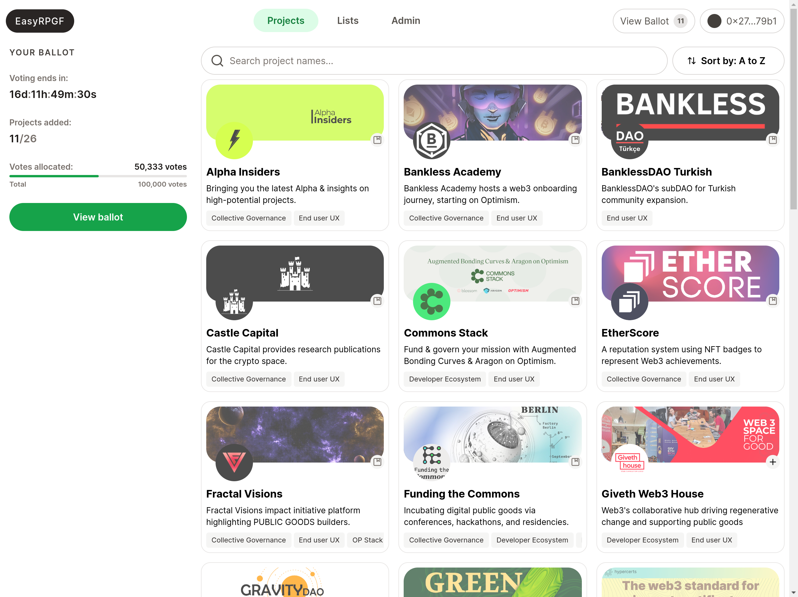

# MACI-RPGF

<div>
<a href="https://maci-rpgf.vercel.app/">View demo</a>
<span>|</span>
<a href="https://discord.com/invite/sF5CT5rzrR">Discord (#🗳️-maci channel)</a>
</div>

[](https://easy-retro-pgf.vercel.app)

## Documentation

MACI-RPGF uses EAS as backbone to run Retroactive Public Goods Funding to reward contributors ([As used by the Optimism Collective](https://community.optimism.io/docs/governance/citizens-house/#how-retro-funding-works)) while adding a privacy layer to reduce bribery and collusion using MACI.

### MACI-RPGF docs

- [Setup & Deployment](./docs/01_setup.md)
- [Adding Projects & Approving](./docs/02_adding_projects.md)
- [Creating Badgeholders/Voters](./docs/03_creating_badgeholders.md)
- [Voting](./docs/04_voting.md)
- [Lists](./docs/05_lists.md)
- [Results](./docs/06_results.md)
- [Distribute](./docs/07_distribute.md)

### MACI docs

- [Documentation](https://maci.pse.dev/)

## Supported Networks

All networks EAS is deployed to are supported. If a network is not supported, you can follow the EAS documentation to deploy the contracts to the network.

- https://docs.attest.sh/docs/quick--start/contracts

#### Mainnets

- Ethereum
- Optimism
- Base
- Arbitrum One & Nova
- Polygon
- Scroll
- Celo
- Linea

#### Testnets

- Sepolia
- Optimism Sepolia
- Base Sepolia
- Polygon Mumbai
- Scroll Sepolia

## Development

To run locally follow these instructions:

```sh
git clone https://github.com/privacy-scaling-explorations/maci-rpgf

cp .env.example .env # and update .env variables

```

At the very minimum you need to configure a postgres database, nextauth, admin address, maci address and the voting periods. For more details head to [Setup & Deployment](./docs/01_setup.md). Once you have set everything run:

```sh
pnpm install

pnpm run dev

pnpm run db:push # create database tables

open localhost:3000
```

### Technical details

- **EAS** - Projects, lists, profiles, etc are all stored on-chain in Ethereum Attestation Service
- **Batched requests with tRPC** - Multiple requests are batched into one (for example when the frontend requests the metadata for 24 projects they are batched into 1 request)
- **Server-side caching of requests to EAS and IPFS** - Immediately returns the data without calling EAS and locally serving ipfs cids.
- **SQL database for ballots** - Votes are stored privately in a Postgres database
  - Could votes be stored on EAS as well? It would need to happen server-side from an admin signer to keep voters anonymous.
- **MACI** - Minimal Anti-Collusion Infrastructure (MACI) is an open-source public good that serves as infrastructure for private on-chain voting, handles the rounds and private voting of the badgeholders.
