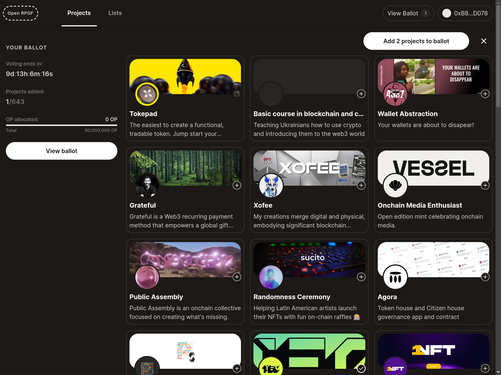
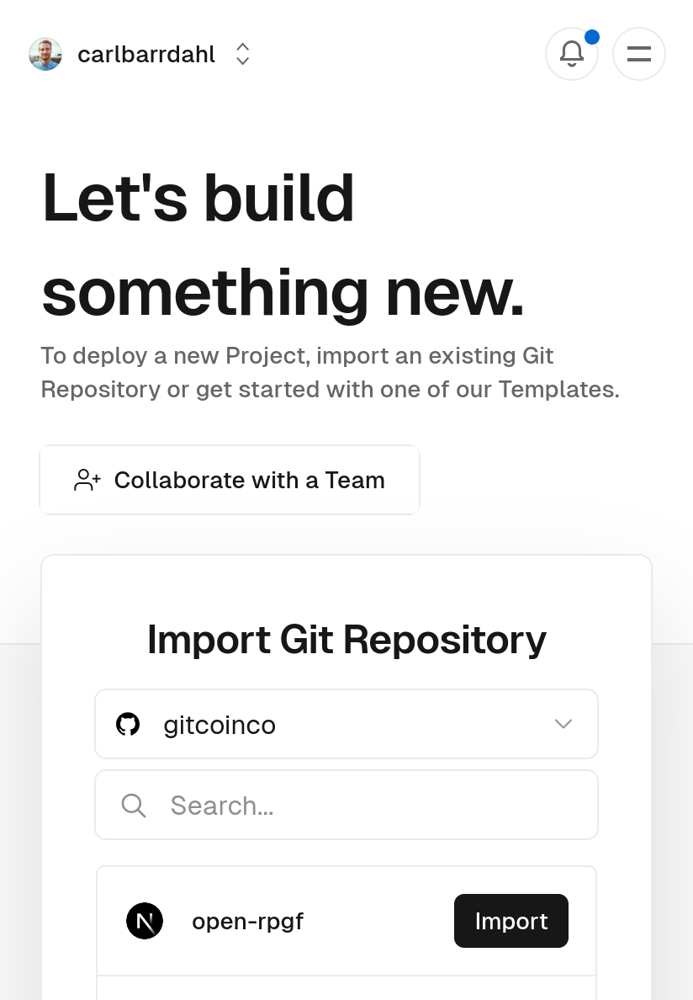

# OpenRPGF

<div style="font-size:18px">

<a href="https://open-rpgf.vercel.app">View demo</a>
<span>|</span>
<a href="https://t.me/+0oycDCvX3QY1NjEx">Telegram Group</a>

<div>

[](https://open-rpgf.vercel.app)

## Deployment

Follow these instructions to deploy your own instance of OpenRPGF.

#### 1. Fork Repo

[Fork OpenRPGF](https://github.com/gitcoinco/open-rpgf/fork)

1. Click to view the `.env.example` file in your newly created repo
2. Copy its contents and paste into a text editor

#### 2. Configuration

The `.env.example` file contains instructions for most of these steps.

At the very minimum you need to configure a postgres database, nextauth and the voting periods under App Configuration.

##### Database

https://vercel.com/dashboard/stores?type=postgres

1. Press Create Database button
2. Select Postgres, press continue, and give it a name and region
3. Press `.env.local` tab, Copy Snippet and paste into text editor

<div>
    
    
</div>

##### Auth

1. Generate a secret (`openssl rand -base64 32`)
2. Configure `NEXTAUTH_URL` (this should only be necessary on localhost or for production domains)

##### Network

The default configuration is Optimism.

You can find supported networks on the EAS documentation website: https://docs.attest.sh/docs/quick--start/contracts

##### App

Configure how many votes each voter receives and how many votes each project can receive.
You can also find configurations for when voting starts and ends as well as the registration and review period.

Here, you can also configure who your admins are. These are the users who will approve applications and voters.

To create your own round you need to do a few things:

- Update `NEXT_PUBLIC_ADMIN_ADDRESSES` with a comma-separated list of wallet addresses that approve the applications and voters (badgeholders)
- Set `NEXT_PUBLIC_ROUND_ID` to a unique identifier that will group the applications and lists you want to list

##### EAS

If you are running on a different network than Optimism you need to update the contract addresses for EAS. These addresses are used whenever an attestation is created.

You can also configure your own schemas here if you wish to.

#### 3. Deploy

https://vercel.com/new

1. Import the repo you created/forked
2. Open the Environment Variables panel
3. Select the first field and paste your variables from your text editor
4. Deploy!

<div>
  
  
</div>

## Additional configuration

### Configure theme and metadata

Edit `tailwind.config.ts` and `src/config.ts`

_You can edit files directly in GitHub by navigating to a file and clicking the Pen icon to the right._

### Creating EAS Schemas and Attestations

You can create your own schemas here:
https://optimism.easscan.org/schema/create

Or run this script

```sh
WALLET_PRIVATEKEY="0x..." npm run eas:registerSchemas
```

## User flow

### 1. Creating applications

- Navigate to https://open-rpgf.vercel.app/applications/new (replace the domain with your deployment)
- Create profile (if not already done so previously)
- Fill out the fields
  - **name** - the name to be displayed
  - **websiteUrl** - your website url
  - **payoutAddress** - address to send payouts to
  - **contributionDescription** - describe your contribution
  - **impactDescription** - describe your impact
  - **contributionLinks** - links to contributions
  - **impactMetrics** - links to your impact
  - **fundingSources** - list your funding sources

This will create an Attestation with the Metadata schema and populate the fields:

- `type: "application"`
- `roundId: NEXT_PUBLIC_ROUND_ID`

### 2. Reviewing and approving applications

- Navigate to https://open-rpgf.vercel.app/applications (replace the domain with your deployment)
- Make sure you have configured `NEXT_PUBLIC_ADMIN_ADDRESSES` with the address you connect your wallet with
- You will see a list of submitted applications
- Select the projects you want to approve
- Press Approve button to create attestations for these projects (send transaction to confirm)

### 3. Registering voters

- Navigate to https://open-rpgf.vercel.app/voters (replace the domain with your deployment)
- Make sure you have configured `NEXT_PUBLIC_ADMIN_ADDRESSES` with the address you connect your wallet with
- Enter a list of addresses you want to allow to vote
- Press Approve button to create attestations for these voters (send transaction to confirm)

### 4. Exploring approved applications

- https://open-rpgf.vercel.app/projects

### 5. Creating lists

- https://open-rpgf.vercel.app/lists/new

### 6. Vote for projects and submit ballot

### 7. Round Results

Results are found on the same page as projects.

- https://open-rpgf.vercel.app/projects

## Development

To run locally follow these instructions:

```sh
git clone https://github.com/gitcoinco/open-rpgf

bun install # (or pnpm / yarn / npm)

cp .env.example .env # and update .env variables

bun run dev

open localhost:3000
```

### Technical details

- **EAS** - Projects, lists, profiles, etc are all stored on-chain in Ethereum Attestation Service
- **Batched requests with tRPC** - Multiple requests are batched into one (for example when the frontend requests the metadata for 24 projects they are batched into 1 request)
- **Server-side caching of requests to EAS and IFPS** - Immediately returns the data without calling EAS of ipfs.
- **SQL database for ballots** - Votes are stored privately in a Postgres database
  - Could votes be stored on EAS as well? It would need to happen server-side from an admin signer to keep voters anonymous.
