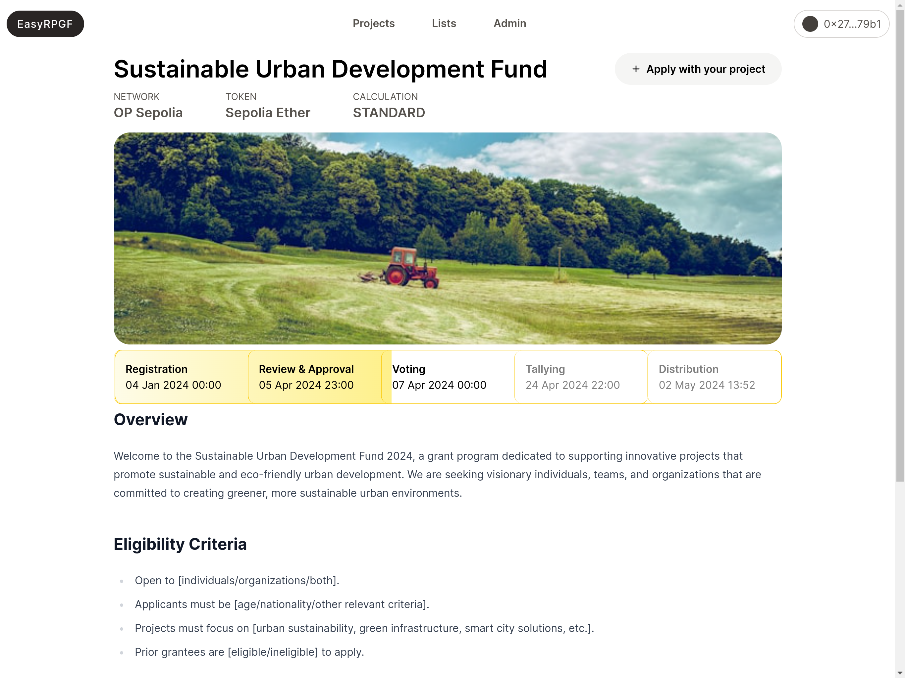

# EasyRetroPGF

<div style="font-size:18px">

<a href="https://easyretropgf.xyz">Website</a>
<span>|</span>
<a href="https://t.me/+0oycDCvX3QY1NjEx">Telegram Group</a>

</div>

## Key Steps
- Set round timing variables in the .env. The application only works with one round at the time.
- Projects applications open
- Admins review applications and approve if relevant
- Voting opens by whitelisted addresses (by admins)
- Results are displayed
- Distribution can be done

<div style="display:flex">

[](https://easyretropgf.xyz/sustainable-urban-development)
[](https://easyretropgf.xyz/sustainable-urban-development/projects)

</div>

## Documentation

- [Setup & Deployment](./docs/01_setup.md)
- [Adding Projects & Approving](./docs/02_adding_projects.md)
- [Creating Badgeholders/Voters](./docs/03_creating_badgeholders.md)
- [Voting](./docs/04_voting.md)
- [Results](./docs/06_results.md)
- [Distribute](./docs/07_distribute.md)

## Supported Networks

All networks EAS is deployed to are supported

- https://docs.attest.sh/docs/quick--start/contracts

#### Mainnets

- Ethereum
- Optimism
- Base
- Arbitrum One
- Linea
- Celo
- Filecoin

#### Testnets

- Sepolia
- Optimism Goerli
- Base Goerli
- Arbitrum Goerli
- Polygon Mumbai
- Linea Goerli

## Development

To run locally follow these instructions:

```sh
git clone https://github.com/gitcoinco/easy-retro-pgf

bun install # (or pnpm / yarn / npm)

cp .env.example .env # and update .env variables

docker-compose up # starts a local postgres instance

bun run dev

bun run db:push # create database tables

open localhost:3000
```

### Technical details

- **EAS** - Projects, profiles, etc are all stored on-chain in Ethereum Attestation Service
- **Batched requests with tRPC** - Multiple requests are batched into one (for example when the frontend requests the metadata for 24 projects they are batched into 1 request)
- **Server-side caching of requests to EAS and IPFS** - Immediately returns the data without calling EAS and locally serving ipfs cids.
- **SQL database for ballots** - Votes are stored privately in a Postgres database
- **Allo2 for token distribution** - Payouts are calculated based on amount of configured tokens in the pool and the vote calculation
