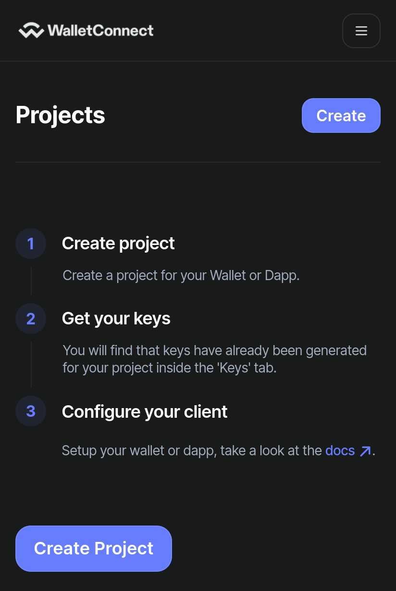
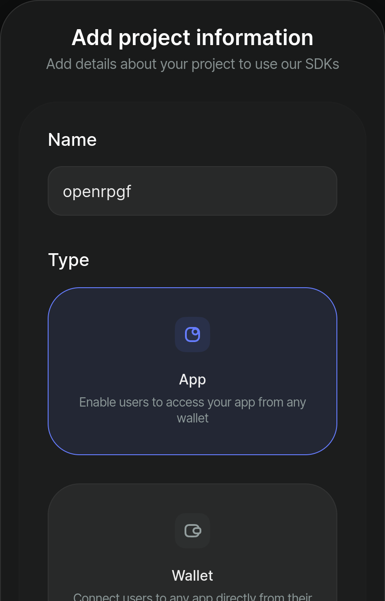
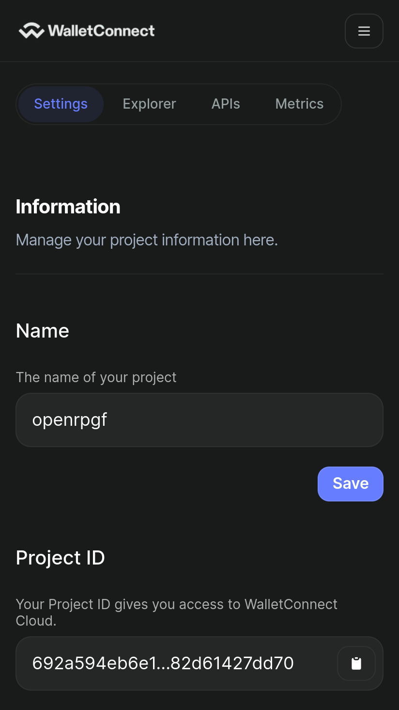

# OpenRPGF

<div style="font-size:18px">

<a href="https://open-rpgf.vercel.app">View demo</a>
<span>|</span>
<a href="https://t.me/+0oycDCvX3QY1NjEx">Telegram Group</a>

<div>

[](https://open-rpgf.vercel.app)

## Deploying

### 1. Fork repo

[Fork OpenRPGF](https://github.com/gitcoinco/open-rpgf/fork)

1. Click to view the `.env.example` file in your newly created repo
2. Copy its contents and paste into a text editor

### 2. Create a Postgres database

https://vercel.com/dashboard/stores?type=postgres

1. Press Create Database button
2. Select Postgres, press continue, and give it a name and region
3. Press `.env.local` tab, Copy Snippet and paste into text editor

<div>
    
    
</div>

### 3. Create a WalletConnect Cloud account

https://cloud.walletconnect.com

1. Sign in or register for a new account
2. Create new Project
3. Copy ProjectId and paste into text editor

> Can we update the code to not require this step? Does Rainbowkit require WalletConnect?

<div>
  
  
  
</div>

### 3. Deploy to Vercel

https://vercel.com/new

1. Import the newly created repo
2. Open the Environment Variables panel
3. Select the first field and paste your variables from your text editor
4. Deploy!

<div>
  
  
</div>

## Additional configuration

### Configure theme and metadata

Edit `tailwind.config.ts` and `src/config.ts`

_You can edit files directly in GitHub by navigating to a file and clicking the Pen icon to the right._

### Creating EAS Schemas and Attestations

> Notice: Currently working on simplifying this process and the schema designs

You can create your own schemas here:
https://optimism.easscan.org/schema/create

#### Approved Applications

Only applications that have been approved will be listed. They are queried from EAS GraphQL API in the following way:

1. Find all the `refUID` for Approved Applications with the following filter:
   - `attester` equals `NEXT_PUBLIC_ADMIN_ADDRESS`
   - `schemaId` equals `NEXT_PUBLIC_APPROVED_APPLICATIONS_SCHEMA`
   - `revoked` equals `false`
2. Find all the Applications matching these `refUID`

#### Approved Voters

Only approved voters are allowed to vote. This check is being done by verifying an Attestation has been created that upfills these criteria:

- `recipient` equals the connected wallet address
- `schemaId` equals the env variable: `NEXT_PUBLIC_BADGEHOLDER_SCHEMA`
- `attester` equals the address configured in the env variable: `NEXT_PUBLIC_ADMIN_ADDRESS`

---

### Configuring the EAS data

All the approved projects, profiles, and lists are stored on-chain in EAS (Ethereum Attestation Service).

To create your own round you need to do a few things:

- Update `NEXT_PUBLIC_ADMIN_ADDRESSES` with a comma-separated list of wallet addresses that approve the applications and voters (badgeholders)
- Set `NEXT_PUBLIC_ROUND_ID` to a unique identifier that will group the applications and lists you want to list

### Creating applications

- Navigate to https://open-rpgf.vercel.app/projects/new (replace the domain with your deployment)
- Create profile (if not already done so previously)
- Fill out the fields
  - **name** - the name to be displayed
  - **websiteUrl** - your website url
  - **payoutAddress** - address to send payouts to
  - **contributionDescription** - describe your contribution
  - **impactDescription** - describe your impact
  - **contributionLinks** - links to contributions
  - **impactMetrics** - links to your impact
  - **fundingSources** - list your funding sources

This will create an Attestation with the Metadata schema and populate the fields:

- `type: "application"`
- `roundId: NEXT_PUBLIC_ROUND_ID`

## Manager UI

### Approving applications

- Navigate to https://open-rpgf.vercel.app/admin/applications (replace the domain with your deployment)
- Make sure you have configured `NEXT_PUBLIC_ADMIN_ADDRESSES` with the address you connect your wallet with
- You will see a list of submitted applications
- Select the projects you want to approve
- Press Approve button to create attestations for these projects (send transaction to confirm)

### Adding approved voters

- Navigate to https://open-rpgf.vercel.app/admin/voters (replace the domain with your deployment)
- Make sure you have configured `NEXT_PUBLIC_ADMIN_ADDRESSES` with the address you connect your wallet with
- Enter a list of addresses you want to allow to vote
- Press Approve button to create attestations for these voters (send transaction to confirm)

---

Make sure the schema matches the expected data models for:

- **Application**
  - https://optimism.easscan.org/attestation/attestWithSchema/0x76e98cce95f3ba992c2ee25cef25f756495147608a3da3aa2e5ca43109fe77cc
- **Approved Applications**
  - https://optimism.easscan.org/attestation/attestWithSchema/0xebbf697d5d3ca4b53579917ffc3597fb8d1a85b8c6ca10ec10039709903b9277
- **Badgeholder**
  - https://optimism.easscan.org/attestation/attestWithSchema/0xfdcfdad2dbe7489e0ce56b260348b7f14e8365a8a325aef9834818c00d46b31b
- **Profile**
  - https://optimism.easscan.org/attestation/attestWithSchema/0xac4c92fc5c7babed88f78a917cdbcdc1c496a8f4ab2d5b2ec29402736b2cf929
- **List**
  - https://optimism.easscan.org/attestation/attestWithSchema/0x3e3e2172aebb902cf7aa6e1820809c5b469af139e7a4265442b1c22b97c6b2a5

The frontend queries the EAS GraphpQL for approved applications in the following way:

---

1. Fetch all the non-revoked attestations with the `schemaId` matching the configured `NEXT_PUBLIC_APPROVED_APPLICATIONS_SCHEMA` and `attester` address matching `NEXT_PUBLIC_APPROVED_APPLICATIONS_ATTESTER`

```sh
NEXT_PUBLIC_APPROVED_APPLICATIONS_SCHEMA
NEXT_PUBLIC_APPROVED_APPLICATIONS_ATTESTER
NEXT_PUBLIC_APPLICATIONS_SCHEMA
```

#### Creating

## Development

```sh
git clone https://github.com/gitcoinco/open-rpgf

bun install # (or pnpm / yarn / npm)

cp .env.example .env # and update .env variables

bun run dev

open localhost:3000
```

### Features

### EAS Types

- **Badgeholders** - Determines who are allowed to vote
- **Projects** - Registered projects
- **Approved Projects** - Approved projects and shown in the UI
- **Profiles** - Profile for projects and lists
- **Lists** - Collection of projects with a recommendation of vote allocations

### Technical details

- **EAS** - Projects, lists, profiles, etc are all stored on-chain in Ethereum Attestation Service
- **Batched requests with tRPC** - Multiple requests are batched into one (for example when the frontend requests the metadata for 24 projects they are batched into 1 request)
- **Server-side caching of requests to EAS and IFPS** - Immediately returns the data without calling EAS of ipfs.
- **SQL database for ballots** - Votes are stored privately in a Postgres database
