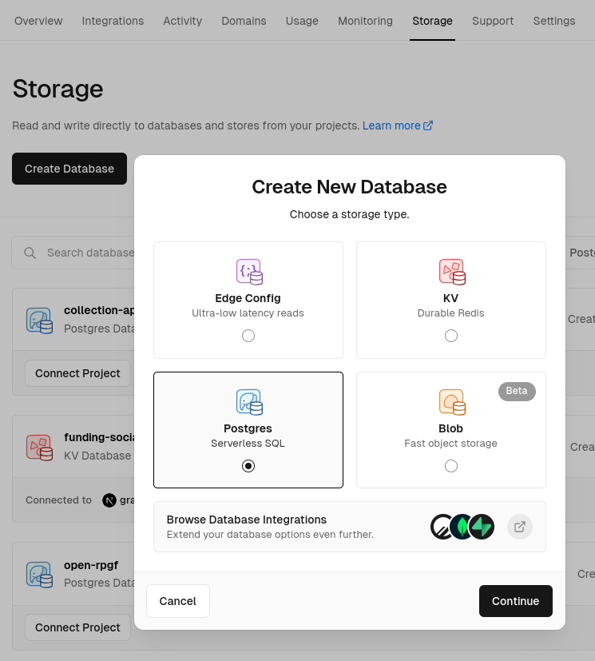
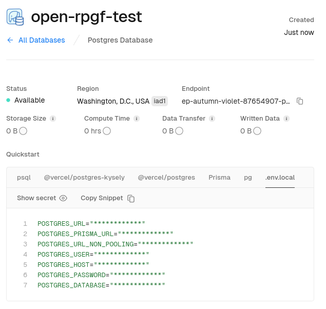
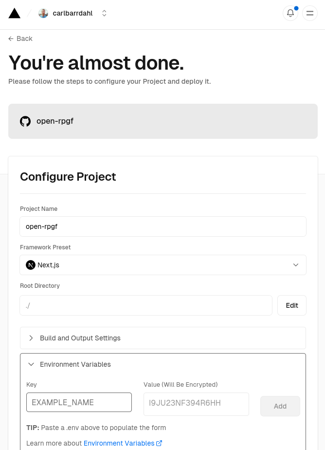

# Setup

Follow these instructions to deploy your own instance of MACI-RPGF.

## 1. Fork Repo

[Fork MACI-RPGF](https://github.com/privacy-scaling-explorations/maci-rpgf/tree/main)

1. Click to view the `.env.example` file in your newly created repo
2. Copy its contents and paste into a text editor

## 2. Configuration

The `.env.example` file contains instructions for most of these steps.

At the very minimum you need to configure a postgres database, nextauth, admin address, MACI address, the EAS Schema and the voting periods under App Configuration.

#### Database

https://vercel.com/dashboard/stores?type=postgres

1. Press Create Database button
2. Select Postgres, press continue, and give it a name and region
3. Press `.env.local` tab, Copy Snippet and paste into text editor

<div>
    
    
</div>

#### Auth

1. Generate a secret (`openssl rand -base64 32`)
2. Configure `NEXTAUTH_URL` (this should only be necessary on localhost or for production domains)

#### Network

The default configuration is Optimism.

You can find supported networks on the EAS documentation website: https://docs.attest.sh/docs/quick--start/contracts

#### App

Configure how many votes each voter receives and how many votes each project can receive.
You can also find configurations for when voting starts and ends as well as the registration and review period.

Here, you can also configure who your admins are. These are the users who will approve applications and voters.

To create your own round you need to do a few things:

- Update `NEXT_PUBLIC_ADMIN_ADDRESSES` with a comma-separated list of wallet addresses that approve the applications and voters (badgeholders)
- Set `NEXT_PUBLIC_ROUND_ID` to a unique identifier that will group the applications and lists you want to list
- Set `NEXT_PUBLIC_MACI_ADDRESS` - your deployed maci contract
- Set `NEXT_PUBLIC_MACI_START_BLOCK` - block where your maci contract is deployed (optional)
- Set `NEXT_PUBLIC_TALLY_URL` - your endpoint for vote results, where you host `tally-{pollId}.json` files.

#### EAS

If you are running on a different network than Optimism you need to update the contract addresses for EAS. These addresses are used whenever an attestation is created.

You can also configure your own schemas here if you wish to, or deploy the EAS contracts to a network that doesn't have them.

## 3. Deploy MACI

As a coordinator you need to deploy a MACI instance and poll.

### Install Maci

You can read about the [MACI requirements here](https://maci.pse.dev/docs/installation). To install MACI run the following commands:

```bash
git clone https://github.com/privacy-scaling-explorations/maci.git && \
cd maci && \
pnpm i && \
pnpm run build
```

### Download .zkey files

Note the locations of the .zkey files as the CLI requires them as command-line flags. Download ceremony artifacts:

```bash
pnpm download:ceremony-zkeys
```

### Set .env Files

Head to the `contracts` folder and copy the `.env.example` file. Make sure to include a mnemonic and RPC url.

```
MNEMONIC="your_ethereum_secret_key"
ETH_PROVIDER="the_eth_provider_url"
ETHERSCAN_API_KEY="etherscan api key"
```

### Generate MACI Keys

Generate a new key pair and save it in a secure place.

```bash
node build/ts/index.js genMaciKeyPair
```

### Set the configuration file

Head to the contracts folder.

```bash
cd contracts && cp
```

Copy the config example and update the fields as necessary:

```bash
cp deploy-config-example.json deploy-config.json
```

> [!IMPORTANT]
> Make sure that you use the production zkeys, set `useQuadraticVoting` to false, and set the pollDuration with the correct time on seconds.

### Deploy MACI Contracts

Run `pnpm deploy` to deploy the contracts (you can specify the network by appending `:network` to the command, e.g. pnpm deploy:sepolia - please refer to the available networks on the package.json scripts section)

```bash
pnpm deploy:NETWORK
```

Run pnpm deploy-poll to deploy your first Poll (you can specify the network by appending :network to the command, e.g. pnpm deploy-poll:sepolia - please refer to the available networks on the package.json scripts section).

```sh
pnpm deploy-poll:NETWORK
```


See [MACI docs](https://maci.pse.dev/docs/integrating#deployment) for more information.

## 4. Deploy

https://vercel.com/new

1. Import the repo you created/forked
2. Open the Environment Variables panel
3. Select the first field and paste your variables from your text editor
4. Deploy!

<div>
  
  
</div>

## Additional configuration

### Configure theme and metadata

Edit `tailwind.config.ts` and `src/config.ts`

_You can edit files directly in GitHub by navigating to a file and clicking the Pen icon to the right._

### Creating EAS Schemas and Attestations

You can create your own schemas by running this script.

```sh
WALLET_PRIVATEKEY="0x..." npm run eas:registerSchemas
```
