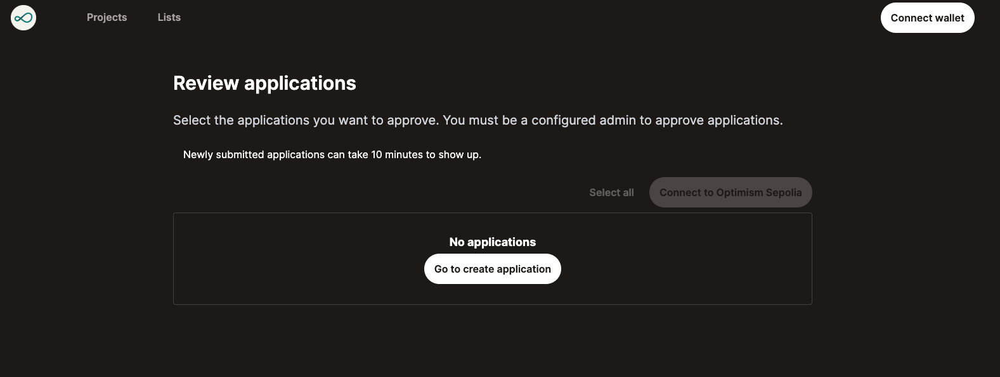
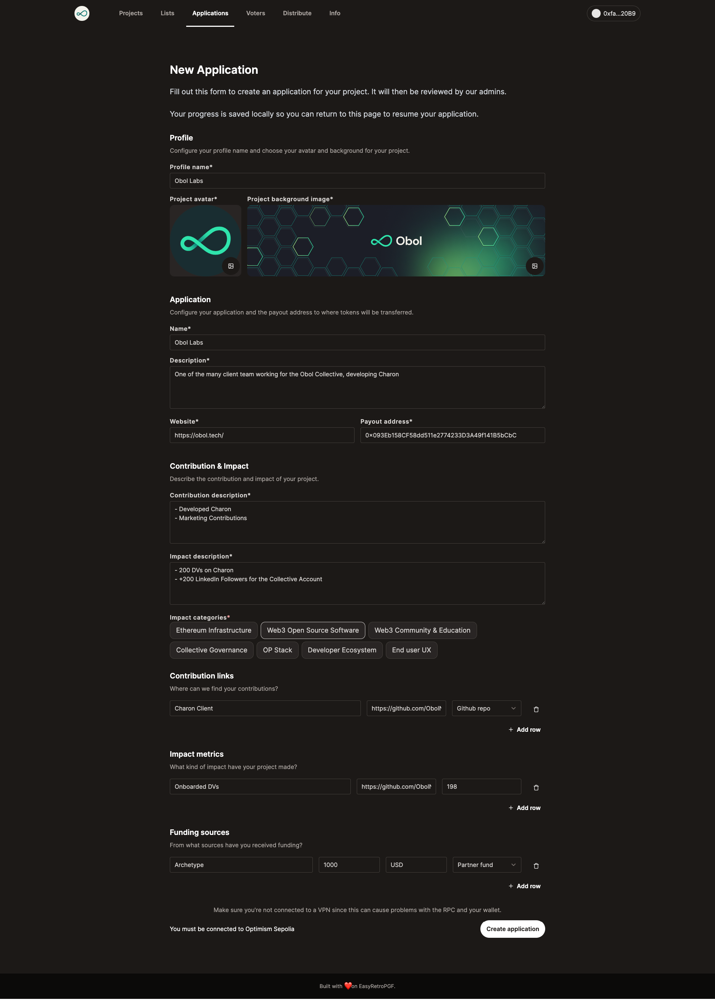
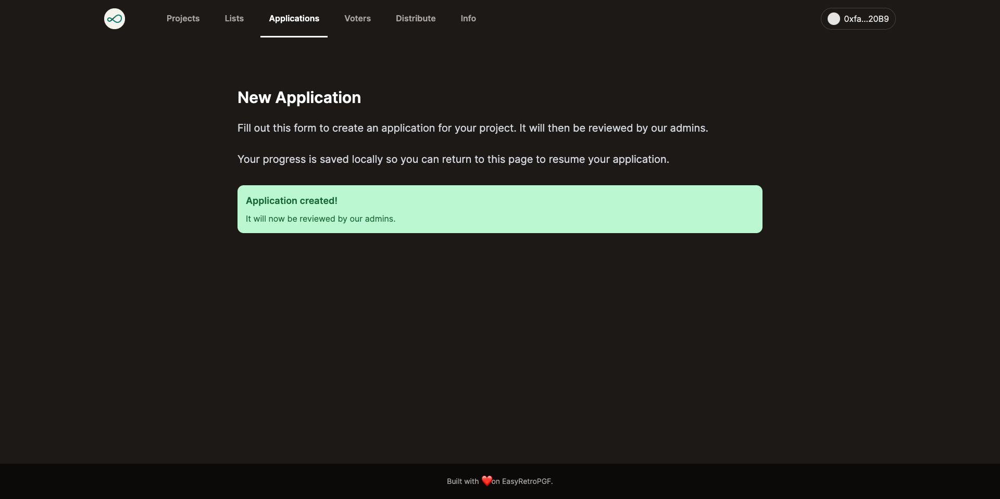
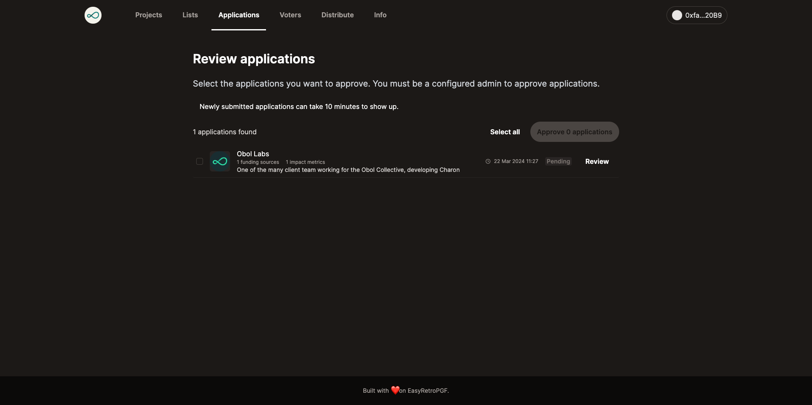
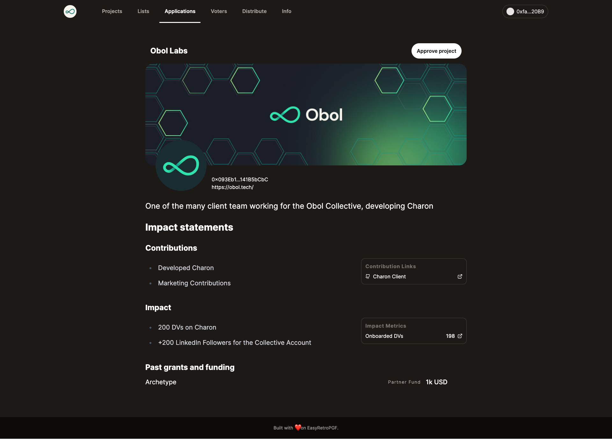
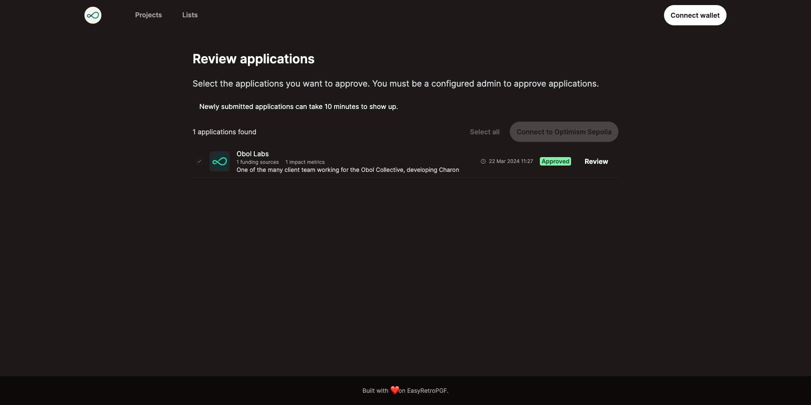

# Anyone can create a project application for RAPGF

- Navigate to https://easy-retro-pgf-ochre.vercel.app/applications/new

- Fill out profile fields with name, profile image and banner image
- Fill out application fields
  - **name** - the name to be displayed
  - **websiteUrl** - your website url
  - **payoutAddress** - address to send payouts to
  - **contributionDescription** - describe your contribution
  - **impactDescription** - describe your impact
  - **contributionLinks** - links to contributions
  - **impactMetrics** - links to your impact
  - **fundingSources** - list your funding sources

This will create an Attestation with the Metadata schema and populate the fields:

- `type: "application"`
- `roundId: NEXT_PUBLIC_ROUND_ID`

## Admin review and approve applications

- Navigate to https://easy-retro-pgf-ochre.vercel.app/applications
- Make sure you have configured `NEXT_PUBLIC_ADMIN_ADDRESSES` with the address you connect your wallet with
- You will see a list of submitted applications

- Press the Review button to open the application

- Select the applications you want to approve
- Press Approve button to create attestations for these projects (send transaction to confirm)

> It can take 10 minutes for the applications to be approved in the UI

