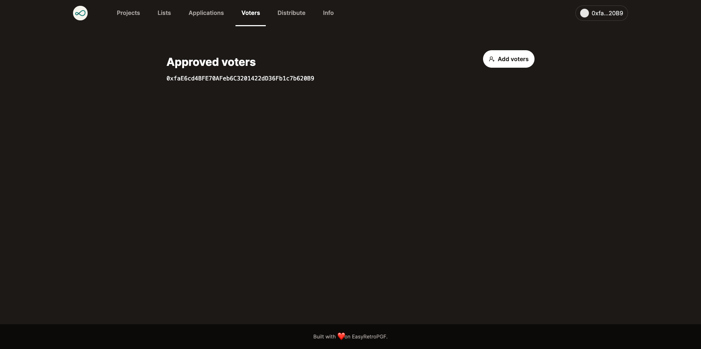

# Creating badgeholders

- Navigate to https://easy-retro-pgf-ochre.vercel.app/voters (replace the domain with your deployment)
- Make sure you have configured `NEXT_PUBLIC_ADMIN_ADDRESSES` with the address you connect your wallet with
- Enter a list of addresses you want to allow to vote (comma-separated)
- Press Approve button to create attestations for these voters (send transaction to confirm)

> It can take 10 minutes for the voters to be seen in the UI

