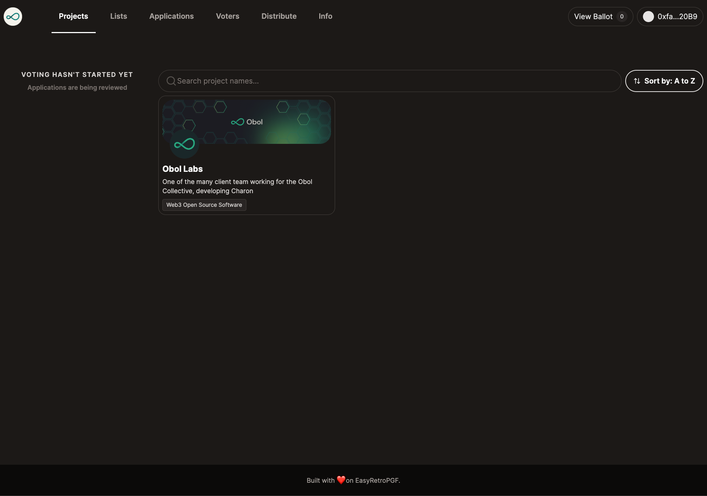
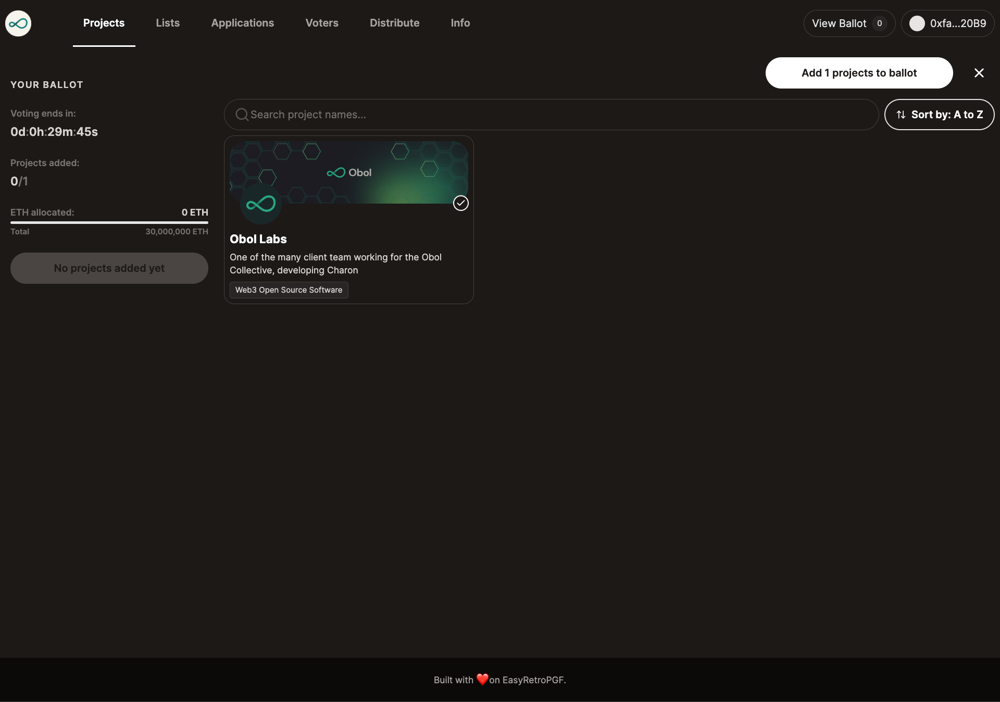
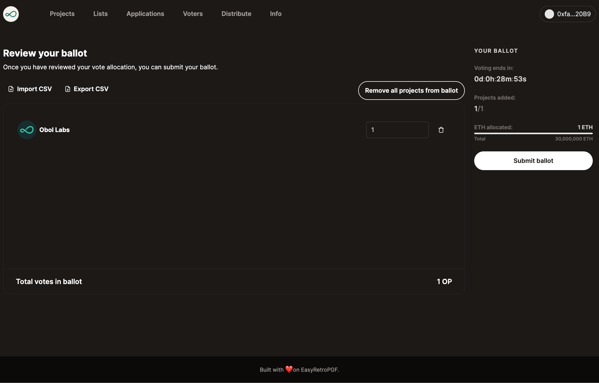
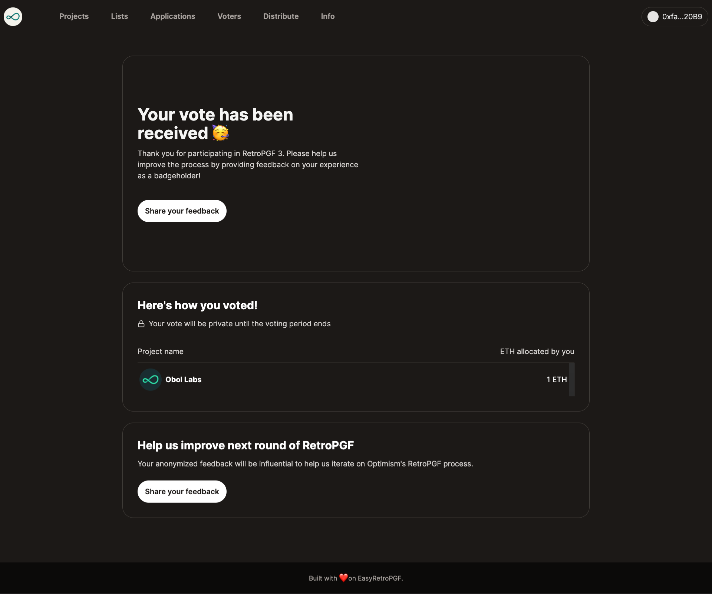

# Voting

Once 
- applications has been approved
- the voters' addresses have been added
- the voting window is open
your voters can now vote for projects

- Navigate to https://easy-retro-pgf-ochre.vercel.app/projects
- Click the plus icon on the project card or Add to ballot button in the project details page

- Click View ballot to navigate to the ballot page (https://easy-retro-pgf-ochre.vercel.app/ballot)

- Adjust the allocation
- Click Submit ballot and sign the message

You can also export your ballot as a CSV to import into Excel where you can make changes and later export as a CSV. This CSV file can then be imported and replace your ballot.

