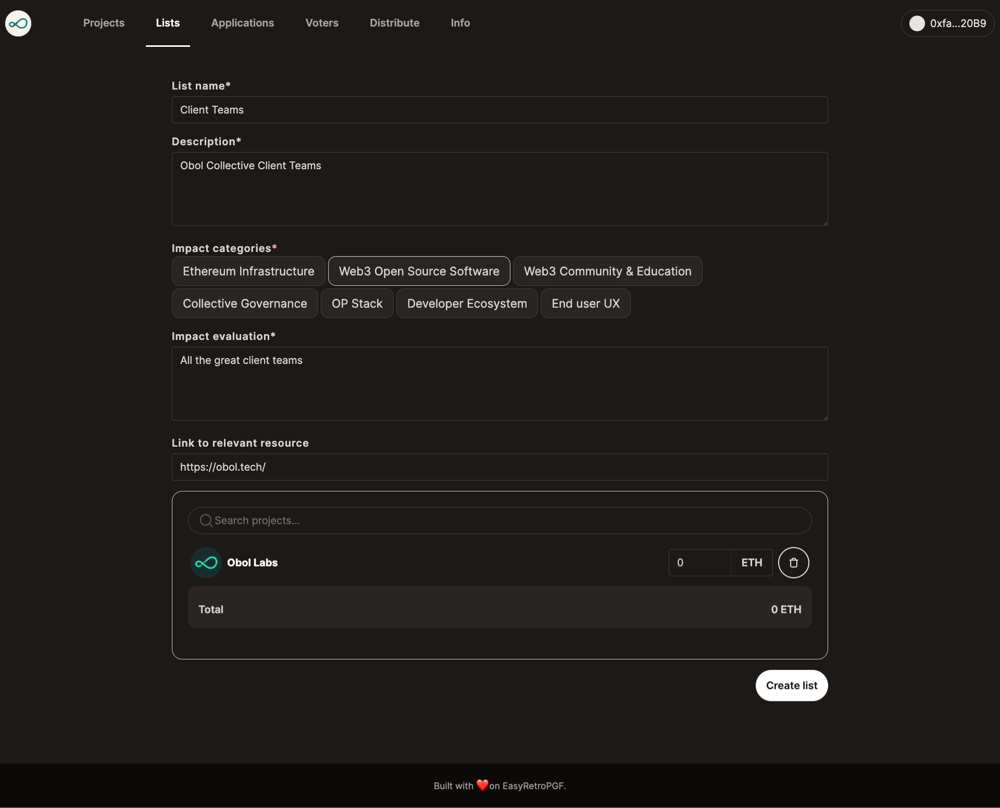

# Lists

Lists can be created to help voters find projects to vote for. These lists include a name, description, impact evaluation, category, and a collection of projects with a recommended amount.

- Navigate to https://easy-retro-pgf-ochre.vercel.app/lists
- Fill out the list details
- Add projects. (currently search is case-sensitive and only matches beginning of project name)
- Click Create and sign the transaction

