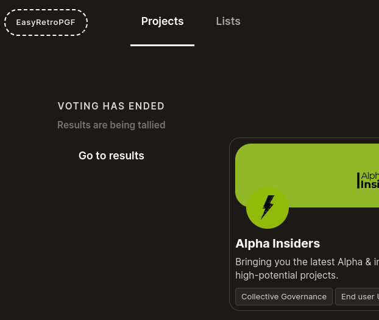
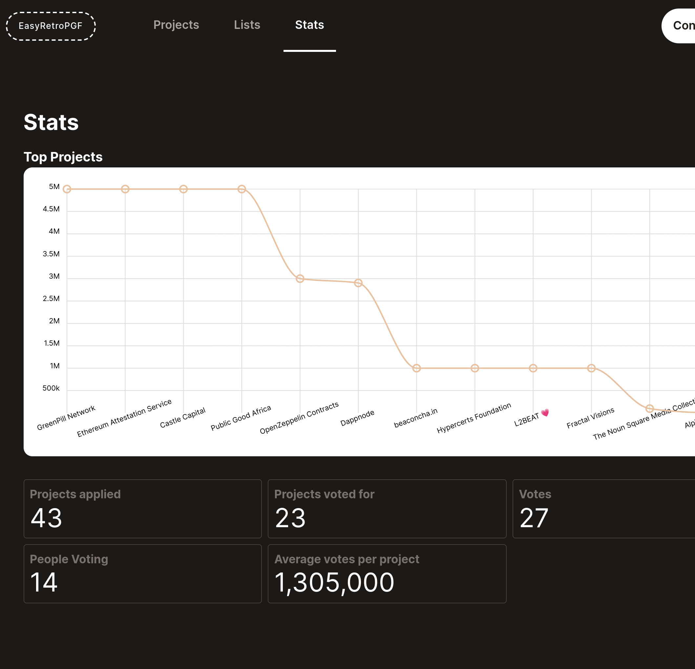

# Results

Once the voting has ended you can view the results. There's an env variable `NEXT_PUBLIC_TALLY_URL`. As a coordinator you need to upload `tally-{pollId}.json` file. Make sure the poll id in the file name is the same as current one.

- https://easy-retro-pgf.vercel.app/projects/results

You can also see statistics of the round:

- https://easy-retro-pgf.vercel.app/stats

