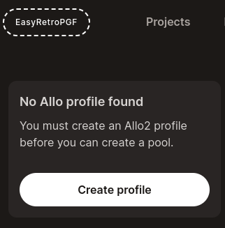
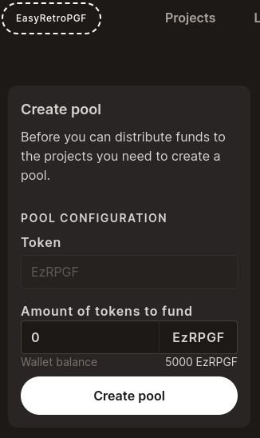
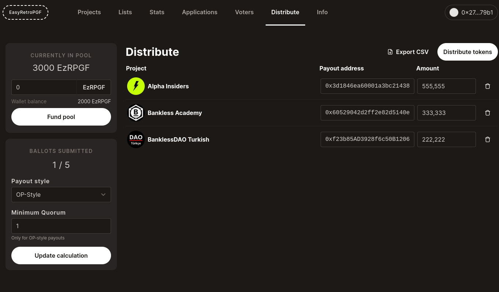
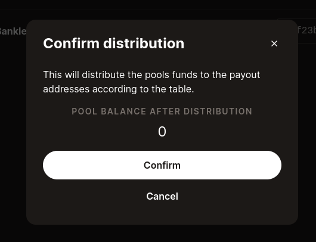

# Distribute

Once the voting has ended you can distribute tokens to the projects.

Navigate to: https://easy-retro-pgf-ochre.vercel.app/distribute

Before you should have configured your chosen payout token: `NEXT_PUBLIC_TOKEN_ADDRESS`

1. First you need to create an Allo2 profile to create a pool
2. Create Pool (you can enter an amount to fund or do that later)
3. Fund Pool
4. Choose Payout style
   - Custom - simply sums all the votes
   - OP-style - calculates median votes + a configurable minimum quorum required (number of voters cast votes for a project)

